# Part 1 Understanding NachOS File System
---------------------------------------------------------------------

## Contents

-	[A] 建立 NachOS File System
	-	[A.1] 設定
	-	[A.2] main.cc (Bootstrap)
	-	[A.3] kernel.h/cc

-	[B] 模擬 Disk 的介面/操作
	-	[B.1] disk.h/cc in machine (模擬硬碟用)
	-	[B.2] synchdisk.h/cc (提供 User 操作 Disk 的介面)

-	[C] NachOS File System
	-	[C.1] Bitmap
	-	[C.2] filehdr.h/cc
	-	[C.3] openfile.h/cc
	-	[C.4] directory.h/cc (目錄)
	-	[C.5] filesys.h/cc (File System 本身)

-	[D] HW Basic Q & A
-	[F] 重點：NachOS 檔案操作流程


## [A] 建立 NachOS File System

-	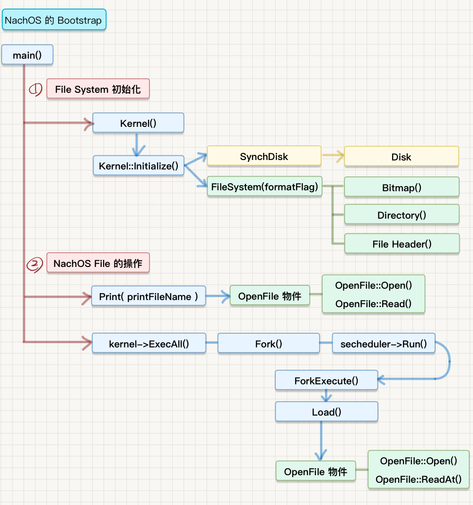
-	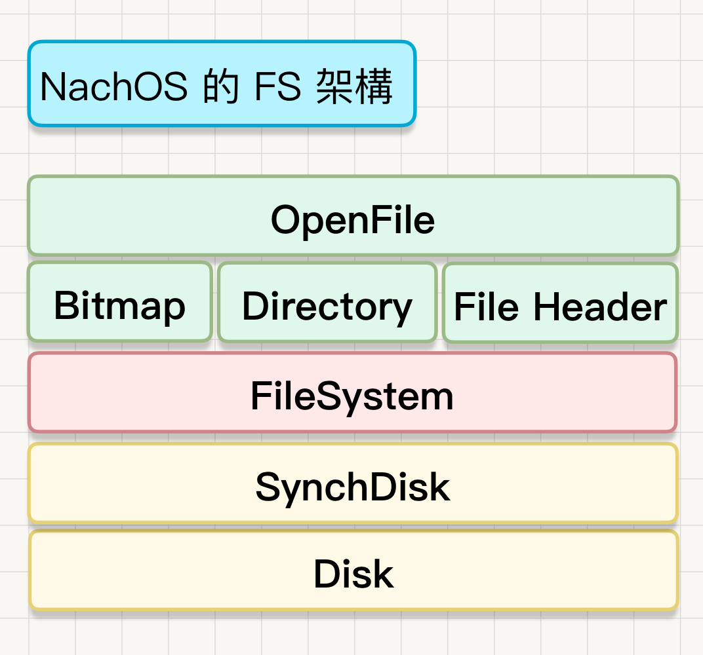

### [A.1] 設定
-	在 build.linux/Makefile 中，可決定是否採用 NachOS 的檔案系統
	> DEFINES =  -DFILESYS_STUB -DRDATA -DSIM_FIX
	( 將 -DFILESYS_STUB 刪去，即採用 Real Nachos file system )

### [A.2] main.cc (Bootstrap)

-	NachOS FS 相關指令  
	-f：	格式化 Nachos 的模擬 Disk (in Kernel(int argc, char **argv) 建構子)
	-cp： 	將 Host File 複製到 NachOS FS 中  
	-p： 	印出 NachOS File Content  
	-r： 	刪除 NachOS File  
	-l： 	List Nachos Directory  
	-D： 	印出 整個 Nachos File System 的內容  

-	static void Copy(char *from, char *to)
	-	主要功能：將 Host File (from) 複製「Name、Content」到 new NachOS File (to)
		-	Open Host File 並計算 fileLength (利用 POSIX API)
		-	來建立 new NachOS File 並 Open NachOS File (利用 NachOS File System)
		-	複製 Host File 內容 到 NachOS File
		-	Close NachOS File

	-	參數：from 為 Host Filename；to 為 NachOS Filename

-	void Print(char *name)
	-	主要功能：印出 名為 name 的 NachOS File Content

-	int main(int argc, char **argv) (與FS相關)
	-	代表 NachOS 的 Bootstrap，負責 Load & Run Kernel

	1.	建立/初始化 NahcOS File System (見 **kernel.h/cc** )
		-	kernel = new Kernel(argc, argv);
		-	kernel->Initialize();

	2.	根據 Command line 來操作 NachOS File
		-	'-r' 刪除 NachOS File 
			= kernel->fileSystem->Remove(removeFileName);
		-	'-cp'將 Host File 複製到 NachOS FS 中
			= Copy(copyUnixFileName,copyNachosFileName);
		-	'-D' 印出 整個 Nachos File System 的內容
			= kernel->fileSystem->Print();
		-	'-l' List Nachos Directory
			= kernel->fileSystem->List();
		-	'-p' 印出 NachOS File Content
			= Print(printFileName); -> Open()

	3.	執行 NachOS File (User Program)
		-	kernel->ExecAll(); -> Fork() -> secheduler->Run()
			-> ForkExecute() -> Load() -> Open()

### [A.3] kernel.h/cc
-	class kernel (與FS相關)
	-	SynchDisk 物件指標、FileSystem 物件指標
	-	formatFlag (用來表示 模擬 Disk 是否需要格式化)

	-	建構子 Kernel(int argc, char **argv)
		-	if (strcmp(argv[i], "-f") == 0) formatFlag = TRUE;

	-	void Initialize()
		-	synchDisk = new SynchDisk();
		-	fileSystem = new FileSystem(formatFlag);
	

## [B] 模擬 Disk 的介面/操作

### [B.1] disk.h/cc in machine (模擬硬碟用)
-	一些常數的設定 in Disk.h
	-	const int SectorSize = 128;			// 128 Bytes  
		const int SectorsPerTrack  = 32;	// 1 Track 32 Sectors  
		const int NumTracks = 32;			// 1 Disk 32 Tracks  
		const int NumSectors = (SectorsPerTrack * NumTracks);	//32 * 32 = 1024個 Sector

	-	1 Disk N Sectors
	-	預設 N = 1024 個 Sectors (可存放 128 KB)

-	一些常數的設定 in Disk.cc  
	(因 模擬 Disk 實際上是一個 UNIX File，為了怕誤用 File Operation in 模擬 Disk，則加入 Magic # 在檔案的開頭來驗證)  
	-	const int MagicNumber = 0x456789ab;  
		const int MagicSize = sizeof(int);  
		const int DiskSize = (MagicSize + (NumSectors * SectorSize));  
	-	模擬 Disk 大小：1024*128 B = 128KB + 4 Bytes  

-	class Disk (繼承於 CallBackObj 自然繼承 CallBack() 方法 )
	-	主要功能：
		-	模擬 Physical Disk，提供 Disk 最底層的功能(上層 NachOS API(synchdisk) 會呼叫以下方法)
			-	模擬 Physical Disk 一次只能處理一個 Access Request
				當 Disk 收到請求，會立即 return，等到操作完成後再發送 Interrupt 通知 CPU
				此時 CPU 才可送出下個 Access Request
			-	操作「模擬 Physical Disk」= 操作一個「UNIX File」

		-	Track Buffer (in RAM)
			-	Track Buffer 會暫存「Disk Head 掃過的同一條 Track 的資料」(in RAM)
				若有 I/O Request 可以直接從此處取值 -> 速度快
				（ 在設計 Disk Scheduling 時，可以不必設計「Skip-Sector」的排班方式」）
			-	Track Buffer 僅儲存一個 Track 的資料
				（ 在 Disk Head 開始讀取 下一個 Track 時，會先將自己清空 ）
			-	開關：可在 build.linux/Makefile 中，可決定是否採用 Track Buffer，宣告下可「關閉」此功能
				> DEFINES =  -DNOTRACKBUF 

		-	Sector # = track * SectorsPerTrack + offset

  	-	public:
    	-	建構子/解構子
			-	Disk(CallBackObj *toCall); 
				-	主要功能：「建立」模擬Disk (一個 Host File)，當 I/O Request 完成時呼叫 toCall->CallBack()
					-	定義 DiskName = Disk_%d，其中 %d = kernel->hostName
					-	若名為 DiskName 存在：
						檢查 檔案最開頭 的 Magic Number 是否正確，若不正確 -> 印出錯誤訊息
						( 呼叫 OpenForReadWrite(..) 即調用 POSIX API open(..)，若檔案存在則進行讀寫操作)
					-	若名為 DiskName 不存在：
						-	建立一個 名為 DiskName 的檔案(Host File) 
							會存在 NachOS 執行檔 的同一個資料夾下 (In Host)
							( 呼叫 OpenForWrite(..) 即調用 POSIX API open(..)，若檔案存在則進行寫入操作，否則建立新檔案)
						-	開頭寫入 Magic Number
						-	結尾寫入 tmp = 0，讓之後 read(..) 不會回傳 EOF

					-	初始化 active = FALSE
				-	參數：
					*toCall：指標 指向「引發中斷」的 模擬硬體物件 
					-> 當 I/O 完成時呼叫 toCall->CallBack() 等同呼叫 模擬硬體物件的 CallBack()

			-	~Disk();	// 關閉硬碟 = Close File
    
    	-	void ReadRequest(int sectorNumber, char* data);
    	-	void WriteRequest(int sectorNumber, char* data);
			-	主要功能：實際處理 一個 R/W I/O Request(開啟 DiskFile 讀寫 Data)，並安排一個模擬中斷  
				(比較 SynchDisk::ReadSector() 是「送出」一個 I/O Request 給 Disk，並請 Disk 處理)

				1.	推算 Disk 讀寫完成的時間 = ticks，並在 ticks 時刻後引發中斷(DiskInt)
					(ticks = ComputeLatency(sectorNumber,..); & kernel->interrupt->Schedule(this, ticks, DiskInt);)
				2.	移動 DiskFile 檔案游標(Current-Position Pointer) 從開頭 到 Sector# 處
					(Lseek(fileno, SectorSize * sectorNumber + MagicSize, 0);)
					([MagicNumber][----][----]...↓[----]...[----])
				3.	開始讀/寫 該位置的資料，大小 = 1個 SectorSize
					(Read/Write(fileno, data, SectorSize);)
				4.	開始讀寫後，設定 Disk 忙碌中 (active = TRUE) 並「更新 lastSector = 本次 sectorNumber」
					(I/O Request 完成後，模擬中斷會呼叫 CallBack()，並重新設定 Disk 為閒置狀態(active = FALSE))
				5.	安排一個「模擬中斷」在過了「ticks 時刻之後引發」(類型是 DiskInt)
				
			-	參數：
				-	sectorNumber
				-	data：讀到的資料 or 將要寫入的資料 (in Bytes)

    	-	void CallBack();
			-	主要功能：設定 Disk 為閒置(active = FALSE)，並呼叫 callWhenDone->CallBack();

    	-	int ComputeLatency(int newSector, bool writing);
			-	主要功能：計算 R/W 要花費的時間(以安排 模擬中斷 發生的時間)

				-	若有採用 Track Buffer，則檢查「是否已暫存 目前 Track 所含的所有 Sectors」
					-	若「(目前時間 - TB開始紀錄時間) > (TB開始紀錄Sector 走到 newSector 的時間)」
						-> 表示 TB 已經紀錄「超過一圈」
						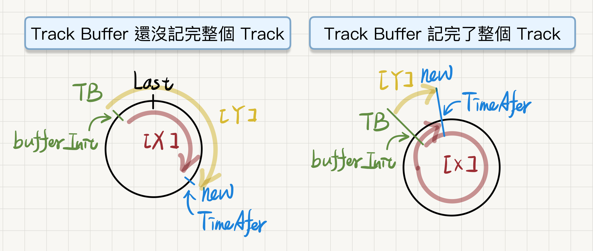
					-	若是 Read 操作，直接從 TB 取值即可 -> 花費 1 RotationTime 的時間
						-> Return Latency = 1 RotationTime

				-	**其餘狀況**：Latency = Seek Time + Rotation Latency + transfer time
					(1)	Seek Time = seek = TimeToSeek(..) 見下方說明(lastSector 到 new Track 的時間差)

					(2)	Rotation Latency = rotation = Part 1 + Part 2

						-	Part 1：從 old Sector 讀到一半 ～ 讀完 Old Sector (可以開始讀下個 Sector 的時間)
							( "[--↓--][----][----]" ～ "[----]↓[----][----]" 的時間差 )
						-	Part 2：目前位置 轉到 newSector 所花的時間

					(3)	Transfer time = 1 RotationTime = 從 new Sector 開頭 讀到 尾端 的時間差
					(4)	Return Latency = Seek Time + Rotation Latency + transfer time

			-	參數：writing = TRUE(寫入)/FALSE(讀取) <- 只有在採用 Track Buffer 才會用到

  	-	private:
		-	私有成員變數
			int fileno;					// 代表模擬 Disk 的 UNIX file number
			char diskname[32];			
			CallBackObj *callWhenDone;	// 指向 toCall = 指向「引發中斷」的 模擬硬體物件
			bool active;     			// Disk 在忙嗎？ TRUE=忙 / FALSE=閒
			int lastSector;				// 上一個請求的 Sector
			int bufferInit;				// Track Buffer 開始暫存「目前 Track 資料」的時刻

		-	以下是 ComputeLatency(..) 用到的函式
			int TimeToSeek(int newSector, int *rotate); 
			-	主要功能：return lastSector(Disk Head) 移動到 newSector 花費的時間(Tick數)
				-	若移動到 new Track，但 Head 讀取 Sector 到一半，需要等待 (*rotation) 的時間「等它讀完」
					-> 如此才能開始讀下一個 Sector -> return (*rotation)
				-	備註：在 stat.h 定義
					RotationTime = 500 (Disk 轉動 1 Sector 的時間)
					SeekTime = 500 (Disk Head 移動 1 Track 的時間)

			int ModuloDiff(int to, int from);
			-	主要功能：return 從 from Sector # 轉到 to Sector # 「要轉幾個 Sectors」
			-	參數：
				-	to % SectorsPerTrack (代表 to Sector # 在 Track 上的位置)
				-	from % SectorsPerTrack (代表 from Sector # 在 Track 上的位置)
			
		-	以下更新「上一次存取的 Sector #」
			void UpdateLast(int newSector);
			-	主要功能：
				-	更新 lastSector 為 newSector
				-	更新 bufferInit (TB 開始存 newTrack 的時刻) = Disk Head 移動到 new Track 的時間點
					若 現在 Head 不在 new Track(newSector 所在 Track) 上，更新 bufferInit
					
-	其他函式
	-	PrintSector (bool writing, int sector, char *data)
		-	主要功能：印出一個 Sector (For 測試用)
		-	參數：writing = TRUE(寫入)/FALSE(讀取)；sector 為 Sector#；data 為資料起始位址


### [B.2] synchdisk.h/cc (提供 User 操作 Disk 的介面)
-	class synchdisk (繼承於 CallBackObj 自然繼承 CallBack() 方法 )
	-	主要功能：
	    -	假設 Physical Disk 一次只能處理一個 Access Request
        -	class SynchDisk 的功能是「提供一個 同步的 Disk Interface = User 取用 Disk 需透過本層」
			-	同步 每個人發出的 Access Requests = 確保一次發出一個 I/O Request 給 Disk
				= 確保 Disk 完成上個操作，才處理下一個請求

	-	public:
    	-	建構子/解構子
			-	SynchDisk();
				-	主要功能：初始化 raw Disk
					-	new Disk(this);		// 建立 模擬硬碟，並設定 中斷發生要呼叫 這裡的 CallBack()
					-	new Semaphore(0);	// Semaphore = 0，wait()=Sleep() & signal()=WakeUp()
					-	new Lock;			// 作為 Mutex 使用 Acquire() & Release()
    		-	~SynchDisk();	
    
    	-	void ReadSector(int sectorNumber, char* data);    				
    	-	void WriteSector(int sectorNumber, char* data);
            -   主要功能：送出 I/O Request 給 Disk，並呼叫 Disk::ReadRequest/WriteRequest 來「實際存取」
                1.	送出 I/O Request 前，先「請求鑰匙/上鎖 = lock->Acquire()」
                2.	送出 I/O Request = 呼叫 disk->ReadRequest(..)
                3.	等待 Disk 工作完成 = semaphore->P() = Wait()
                    若 Disk 完成 會呼叫 ISR = CallBack() = semaphore->V() = Signal()
                    並喚醒 Thread 執行到一半的 ReadSector(..)/WriteSector(..)
                4.	完成 I/O Request 後，則「釋放鑰匙/解鎖 = lock->Release()」

    	-	void CallBack();	// 當目前 Disk 操作完成時，Disk ISR 會呼叫此函式

	-	private:
    	-	Disk *disk;				// 指向模擬 Disk
    	-	Semaphore *semaphore; 	// 用來同步 Requesting ISR 的 Semaphore
    	-	Lock *lock;		  		
			-	用來當 Mutex (鎖住 Critical Section = 存取 Disk 的操作)
			-	只有一個 R/W request 可以被送到 Disk

## [C] NachOS File System

### [C.1] Bitmap
-	Bitmap 就是一串 0101 的 Array，每個 bit 代表一個成員，可設為 0 或 1

(bitmap.h/.cc)
-	class Bitmap 
	-	public:
		-	建構子/解構子
			-	Bitmap(int numItems);
				-	主要功能：建立 numItems 個 bits 的 Bitmap，並設定初始值「全為0」
					-	指標 map 指向「unsigned int 陣列」包含 numWords 個元素(至少包含 numBits 個位元)
			
			-	~Bitmap();	// delete map;
		
		-	基本操作
			-	void Mark(int which);   	
				-	主要功能：設定「第 which 個位元」= 1
				-	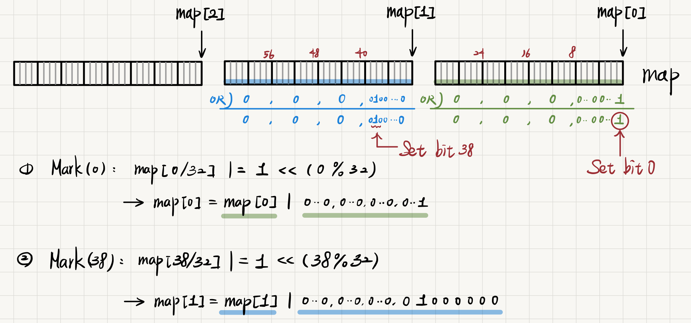
			-	void Clear(int which);
				-	主要功能：設定「第 which 個位元」= 0

			-	bool Test(int which) const;
				-	主要功能：若「第 which 個位元」= 1 則 return TRUE；否則 return FALSE
			
			-	int FindAndSet();
				-	主要功能：Pop out/Set Free Bit
					-	尋找 & 設定「首個 為0 位元」= 1 (Side effect 才是目的)，並 return Bit # (Pop out Free Bit)
					-	若沒有「為0位元」則 return -1 (沒有 Free Bit)

			-	int NumClear() const;	// Return the number of clear bits
				-	主要功能：return 為0位元 的個數 (Num of Clear Bits)

		-	測試用操作
			-	void Print() const;		// 印出 哪些位元，其值 = 1 (ex. 0,3,5,6 表示 0110,1001)
			-	void SelfTest();		// 測試一下所有 Class Bitmap 的方法

	-	protected:
		int numBits;			// Bitmap 的位元個數
		int numWords;			// Bitmap = unsigned int map[numWords]
		>	Bitmap 以一個 unsigned int 陣列呈現，並包含 numWords 個元素
			numWords = divRoundUp(numBits, BitsInWord)
			  
		unsigned int *map;		// 指向「動態配置 Bitmap Array」的指標

(pbitmap.h/.cc)
-	Bitmap 會在 Memory 被建立，寫回 Disk 時，會存成一個 NachOS File，成為 Persistent Bitmap
	-	預設 Free Sector Bitmap File 存在 Sector 0 = FreeMapSector
	
-	class PersistentBitmap : public Bitmap
	-	性質
		1.	class PersistentBitmap 繼承於 class Bitmap，擁有 Bitmap 所有方法
		2.	並加入「直接從 Disk 存取 FreeMapSector」的功能
	-	public:
		-	建構子/解構子
			-	PersistentBitmap(int numItems);
			-	PersistentBitmap(OpenFile *file, int numItems); 
				-	有2種 建立 Bitmap 的方式
				1.	在 Memory 中，動態配置一個 Bitmap (in RAM) = Bitmap(int numItems)
				2.	假設已開啟「存在 Disk」的「**Bitmap File**」(NachOS 開機時 即會開啟)
					-	Bitmap File 存在 Sector 0
					-	file->ReadAt((char *)map, numWords * sizeof(unsigned), 0);
						從 position = 0 處開始讀取，將「numWords * 4」Bytes 的資料 存入 map 指向的空間

			-	~PersistentBitmap();

		-	針對 Disk 的操作
			-	void FetchFrom(OpenFile *file);     // read bitmap from the disk
				-	主要功能：從 File (in Disk) 中讀出 Bitmap，存入 map 指向的空間
					-	file->ReadAt((char *)map, numWords * sizeof(unsigned), 0);

			-	void WriteBack(OpenFile *file); 	// write bitmap contents to disk
				-	主要功能：將 map 指向的空間 = 修改的 Bitmap 存入 File (in Disk) 中
					-	file->WriteAt((char *)map, numWords * sizeof(unsigned), 0);


### [C.2] filehdr.h/cc
-	File Header = FCB(File Control Block) = inode (in Unix)
	-	一個 File 會對應 一個 FCB
	-	每個 FCB 會存放 File's Data 在 Disk 存放的位置 & File Size
		(真實 FS 的 FCB 仍會包含「存取權限、Owner、上一次修改時間...etc」)

	-	實作方式
		-	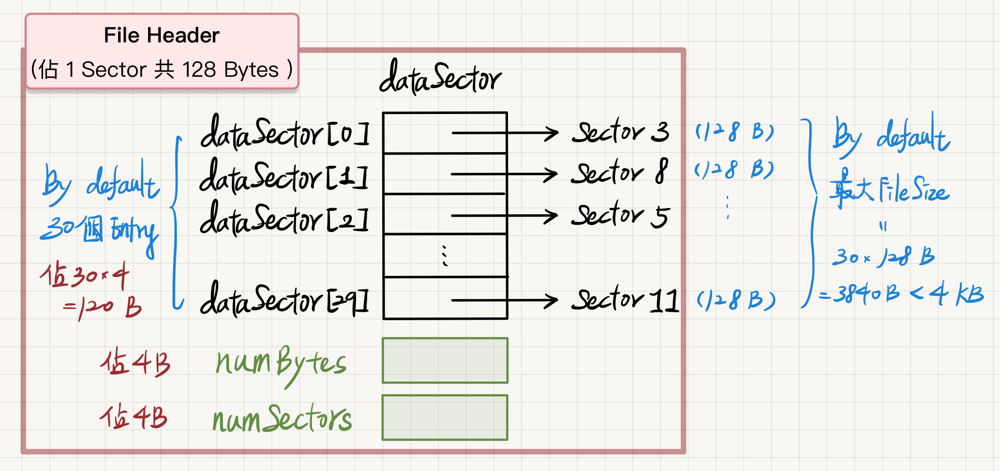

		-	File Size：用2個int變數 numBytes & numSectors 表示 File 的大小(Bytes) & File 所包含的 Sectors 數目
		-	Location Table
			-	用一個「固定大小的 Table(int Array)」，每個 Entry(int) 存放 File's Data Block 所在的 Sector #
				-	宣告 int dataSectors[NumDirect]，NumDirect 為 Table 的 Entry 總數
					其中 dataSectors[i] = k，表示 File 的「第i個 Data Block」存在 Sector k
					(預設不採用 indirect / doubly indirect blocks)
			-	Table Size = (預設)1 SectorSize - 8 Bytes = 120 Bytes
				(扣掉 8 Bytes = 2個int變數 存放 numBytes & numSectors )

	-	初始化時機
		-	New File：直接修改「已建立在 Memory 的 File Header」，讓其指向「新分配的 Sector #」
		-	File in Disk：從 Disk 載入 File Header 到 Memory

-	一些常數的設定 in filehdr.h
	-	NumDirect = File Header(Table) 的 Entry 總數 = (Table 大小)/(Entry 大小)
		-	Table 大小 = SectorSize - 2 * sizeof(int) = 1 SectorSize(128 Bytes) - 2*4 Bytes
			(File Header 預設佔用 1 Sector Size，其中 2個int變數 存放 numBytes & numSectors，剩下存 dataSectors[..])
		-	Entry 大小 = sizeof(int)，存放 Sector #
		-	預設 NumDirect = (128-8)/4 = 30 個 Entry
		
	-	MaxFileSize	= NumDirect( Entry總數 = 最多 Sector 數目) * SectorSize
		最大 File Size = 30 * 128 B = 3840 Bytes < 4 KB

-	class FileHeader
	-	public:
		-	分配 Free Sector & 收回 Allocated Sector
			-	bool Allocate(PersistentBitmap *freeMap, int fileSize);
				-	主要功能
					-	針對大小 = fileSize(Bytes) 的 **New File**，分配足夠的 Free Sector 並記錄在 File Header 中
					-	若 Free Sectors 不夠，return FALSE
				-	參數
					-	freeMap 指向一個「存在 Disk 的 Bitmap 物件 (負責維護 Free Sector)」
					-	fileSize：File 的大小 (in Bytes)

			-	void Deallocate(PersistentBitmap *freeMap);
				-	主要功能：將 freeMap 中，File 所佔 Sector 代表的位元「設為0」
					(Disk 不必將 Sector 的資料清空，但 SSD 則需要)

		-	從 Disk 存取「存在 sectorNumber」的 File Header
			-	void FetchFrom(int sectorNumber);	// 取出 File Header
			-	void WriteBack(int sectorNumber);	// 存入「已修改」的 File Header

		-	int ByteToSector(int offset)
			-	主要功能：return 第offset個 Bytes 的資料，存在「哪個 Sector #」
				-   Sector # = dataSectors[offset / SectorSize]
				-	ex. offset = 392，表示「第392個 Bytes 的資料」存在 File 所佔的「第 392/SectorSize 個 Sector」
						又 392/128 = 3.06，即為 第4個 Sector = dataSector[3] (從0開始算)
			-	參數
				-	offset：代表 File 中「第幾個 Bytes」

		-	int FileLength();	// return File Size (in Bytes)

		-	void Print();
			-	主要功能：印出 File Header(FCB) & File 的所有內容
				-	先印出 File Size & Loaction Table
				-	再印出 File 的所有內容 (讀取 & 印出 dataSectors[0]～dataSectors[numSectors-1])

	-	private:
		-	int numBytes;					// File Size (in Bytes)
		-	int numSectors;					// File 包含的 Sectors 數目
		-	int dataSectors[NumDirect];		
			-	File Header 中「指向 File's Data 存放位置 的 Table」，是一個 int 陣列
			-	每個 Entry = dataSectors[i] 代表「第i個Data Block」對應存放的「Sector #」
				其中 Entry 數目最多 有 NumDirect(30)個，表示 File Size 最大 = 30 * 128 B

### [C.3] openfile.h/cc 

-	OpenFile 物件：代表 File Header & Seekposition，提供 Read/Write Opened File 的操作
-	NachOS 的 File System 中，File 必須要先 Open 才能 R/W，完成所有操作後 即可 Close File
-	Open File = 建構子 OpenFile(..)；Close File = 解構子 ~OpenFile(..)

-	class OpenFile
	-	public:
		-	建構子/解構子
			-	OpenFile(int sector)
				-	主要功能：從 Disk 的 sector 中，將 FileHeader Load 到 Memory (由 hdr 來指)，並設定 seekPosition = 0

			-	~OpenFile();
				-	主要功能：delete hdr (等同關閉檔案)

		-	void Seek(int position)
			-	主要功能：seekPosition = position;

		-	R/W 操作
			-	int Read(char *into, int numBytes); 
			-	int Write(char *from, int numBytes);
				-	主要功能：從 seekPosition 開始 R/W File，並 return R/W 的 Bytes 數目
					-	呼叫 ReadAt(..)/WriteAt(..)，從 seekPosition 開始 R/W File
						其中 ReadAt(..)/WriteAt(..)「不會改變」seekPosition 的位置
					-	(Side Effect) seekPosition += result;
					-	return 「成功」存取的 Bytes 數目(result)
						(若失敗，則 return 0)

				-	參數
					-	into：一個指標 指向暫存「讀出資料的 Buffer」
					-	from：一個指標 指向暫存「寫入資料的 Buffer」
					-	numBytes：欲 R/W 的 Bytes 數目

			-	int ReadAt(char *into, int numBytes, int position);
			-	int WriteAt(char *from, int numBytes, int position);
				-	背景：因為 Disk 只能存取「整個 Sector」，故在此會 區分/存取「需要的部分」  

				-	ReadAt(..)：從 postition 處 開始讀取 numBytes 的資料，並存入 into 指向的空間；最後回傳 numBytes
					1.	檢查 參數是否合法，若不合法 且 無法修正，則 return 0
					2.	計算 要存取的「1st Sector & last Sector & Sector 數目」
					3.	讀出資料
						-   動態配置一個 Buffer 來暫存 讀入的資料 char buf[Sector數 * SectorSize]
						-   ```C++
							for (i = firstSector; i <= lastSector; i++)
								kernel->synchDisk->ReadSector(hdr->ByteToSector(i * SectorSize),
										&buf[(i - firstSector) * SectorSize]);
							```
						-   讀取 sectorNumber 的資料：synchDisk->ReadSector(sectorNumber,*data)
						-   查詢 File Header 找出 第 i * SectorSize 個 Bytes 在哪個 Sector #
							-   sectorNumber = hdr->ByteToSector(i * SectorSize) 
						-   將讀出的 Sector 存入 buf[ (i - firstSector) * SectorSize ]
						-   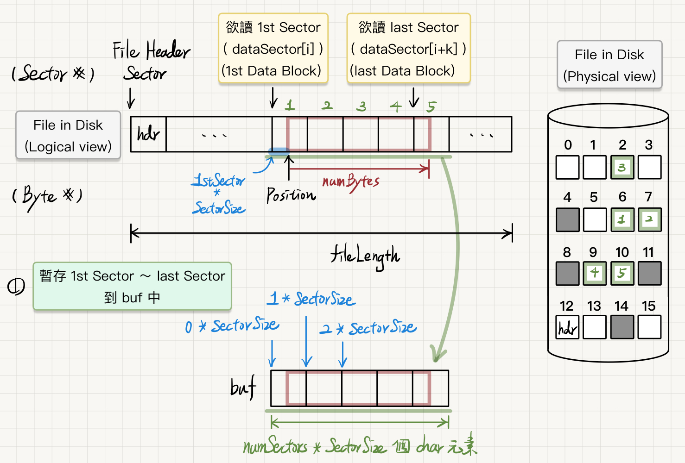
						
               		4.	將 position 處開始往後 numBytes 的資料，複製到 into指向空間 中
						```C++
						bcopy(&buf[position - (firstSector * SectorSize)], into, numBytes);
						```
						-	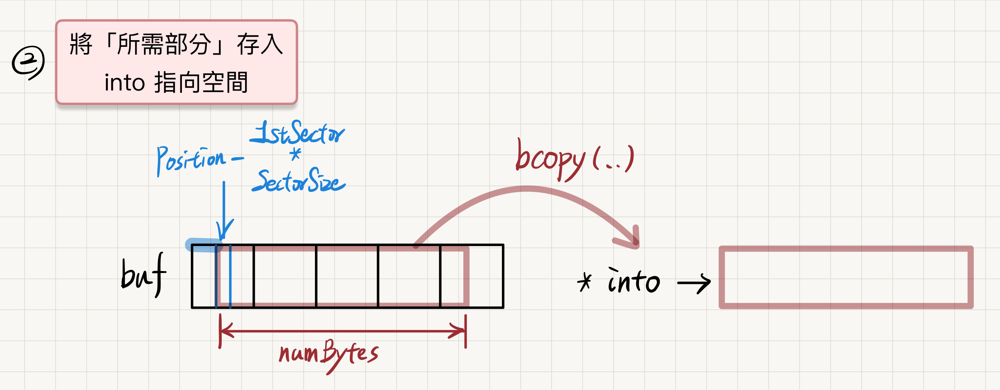

					5.	return numBytes;
						
				-	WriteAt(..)：將「已修改資料 = from指向空間」+「部分未修改的原資料」存入 buf 後，再整個 WriteBack；最後回傳 numBytes
					-	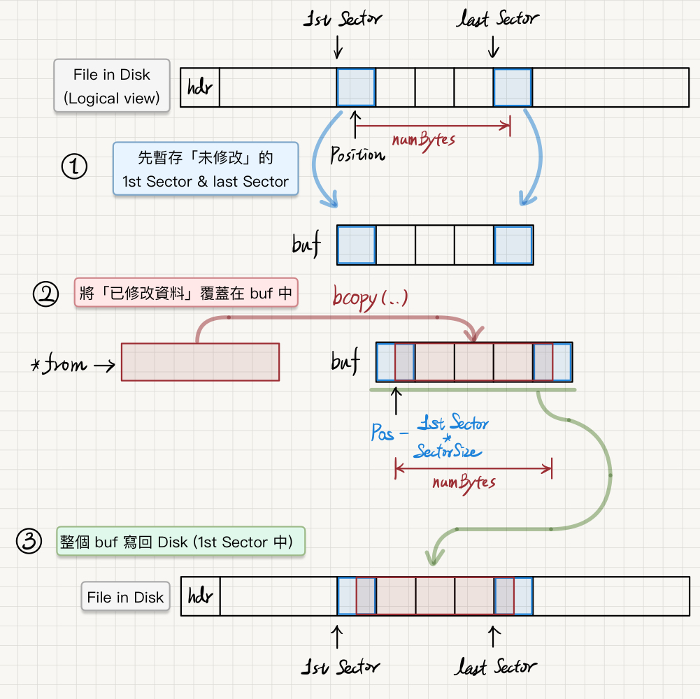
					1.	檢查 參數是否合法，若不合法 且 無法修正，則 return 0
					2.	計算 要存取的「1st Sector & last Sector & Sector 數目」
					3.	工具配置
						-	動態配置一個 Buffer 來暫存資料 char buf[Sector數*SectorSize]
                        -   檢查 position 是否「剛好」位於 1st Sector 的開頭
                            -> 若是，firstAligned = TRUE
                        -   檢查 position + numBytes 是否「剛好」位於 last Sector 的末端
                            -> 若是，lastAligned = TRUE

					4.	將「已修改的資料 (from 指向空間)」覆蓋到 buf 中
						-   若 firstAligned、lastAligned = FALSE (沒對齊)
        					則先將 1st Sector & last Sector 的資料讀進 buf 中，以便之後覆蓋
						-	從 from 指向位置 往後 numBytes 的資料，複製到 buf(position以後的空間) 中
							```C++
							bcopy(from, &buf[position - (firstSector * SectorSize)], numBytes);
							```
					5.	將 暫存「修改資料」的 buf (逐個 Sector) 寫回寫回 Disk
						-   ```C++
							for (i = firstSector; i <= lastSector; i++)	
							kernel->synchDisk->WriteSector(hdr->ByteToSector(i * SectorSize), 
									&buf[(i - firstSector) * SectorSize]);
							```
					6.	return numBytes;

				-	參數
					-	into：一個指標 指向暫存「讀出資料的 存放的空間」
					-	from：一個指標 指向暫存「寫入資料的 存放的空間」
					-	numBytes：欲 R/W 的 Bytes 數目
					-	position：欲從 postition 處 開始存取

		-	int Length(); 	// return File Header 所存的 File Size
    
	-	private:
		-	FileHeader *hdr;	// 指向「目前開啟」檔案的 File Header
		-	int seekPosition;	// 「目前開啟」檔案的 Current-Position Pointer


### [C.4] directory.h/cc (目錄)
-	Directory 就是一個 Table，每個 Entry = <file name, File Header Pos(Sector #), inUse>
	-	每個 Entry 的大小固定 = filename(10 Chars) + Sector # (1 int = 4 Chars) + inUse (1 Char) 約共 15 Bytes
		因為 Sector # 大小固定，表示 Filename 的長度必須有限制

	-	Directory Table 的大小固定，在 Directory 建立時，呼叫 Directory(int size) 即確定大小
		= 固定 Entry 的個數 = 固定 Directory 可容納的 File 數目
		( 若 Directory 沒有 Free Entry，則不可再建立 new File )

-	Directory 會在 Memory 被建立，寫回 Disk 時，會存成一個 NachOS File
	-	預設 Directory File 存在 Sector 1 = DirectorySector

-	一些參數的定義
	-	FileNameMaxLen = 9	// Filename ≤ 9個 char

-	class DirectoryEntry
	-	public:
		-	bool inUse;		// 指示 Directory Entry 是否「被使用」
		-	int sector;		// 只是 File Header 的 Sector # (在 Disk 的位置)
							
		-	char name[FileNameMaxLen + 1];
			// 一個 char 陣列，用來存放 Filename(9 chars) + '\0'(1 char)

-	class Directory
	-	public:
		-	建構子/解構子
			-	背景：當 Disk 剛被格式化，需建立一個 new Directory (不然直接 FetchFrom Disk 即可)
			-	Directory(int size);
				-	主要功能：建立/初始化 Table[size]
					-	Table Entry = class DirectoryEntry，且所有 Table Entry 皆未使用(inUse = FALSE)
					-	tableSize = size
					
			-	~Directory();

		-	載入/寫回 Directory
			-	void FetchFrom(OpenFile *file); 
			-	void WriteBack(OpenFile *file);	
				-	主要功能：從 Disk 將 Direcotry 載入 Memory / 將「已修改」Direcotry 寫回 Disk
					-	假設已開啟「存在 Disk」的「**Direcotry File**」(NachOS 開機時 即會開啟)
						-	Direcotry File 存在 Sector 1
						-	file->ReadAt((char *)table, tableSize * sizeof(DirectoryEntry), 0);
							(從 position = 0 處開始讀取，將「tableSize * sizeof(DirectoryEntry)」Bytes 的資料 存入 table 指向的空間)

						-	file->WriteAt((char *)table, tableSize * sizeof(DirectoryEntry), 0);
							(將 table 指向空間中「tableSize * sizeof(DirectoryEntry)」Bytes 的資料，寫入 File position = 0 處)

		-	Search、Add、Remove
			-	int Find(char *name);		
				-	主要功能：找到 name 的 File Header 位置(Sector #)
					-	呼叫 FindIndex(..) 
					-	根據 name 搜尋 Directory
						若找到 Filename = name，則 return FCB(File Header) 所在的 **Sector #**
						若找不到，return -1

			-	bool Add(char *name, int newSector);
				-	主要功能：
					-	尋找 Directory Table 中「未使用的 Entry」
					-	若找到 -> 將該 Entry 分配給「名為 name 的 File」使用，並 return TRUE
						( 設定 table[i].inUse = TRUE & table[i].name = name & table[i].sector = newSector )
					-	若沒找到 -> return FALSE

			-	bool Remove(char *name);
				-	主要功能：根據 name 搜尋 Directory，若找到該 Entry 則設為「未使用」並 return TRUE；否則 return FALSE

		-	Traversal
			-	void List();
				-	主要功能：印出 Directory 所有的 File 的 Filename (使用中 Entry 的 name)

			-	void Print();
				-	主要功能：印出 Directory 所有的 File、對應 Sector # 以及 File Header + File 的內容

	-	private:
		-	int tableSize;				// Directory entries 的個數
		-	DirectoryEntry *table;		// Directory Table，每個 Entry = <file name, File Header Pos(Sector #)>

		-	int FindIndex(char *name);
			-	主要功能：根據 name 搜尋 Directory，若找到 Filename = name，則回傳該 Entry <Filename,Sector#> 的 Index
				-	strncmp(char *s1, char *s2, size_t n)
        			比較 s1 & s2 的「前n個字元」-> 若 s1 > s2，回傳值 > 0；若 s1 = s2，回傳值 = 0

				-	若 Entry 被使用，且 Filename = 欲搜尋的 name -> return Entry Index(i)
					若沒找到 return -1
			


### [C.5] filesys.h/cc (File System 本身)
-	背景：建立在「模擬 Disk 之上的介面」
-	結構
	-	提供：Create()、Open()、Delete() 等功能
		( File 開啟後的操作(read、write、close)定義在 OpenFile Class )

	-	File 結構
		-	File Header(FCB)
			-	預設大小 = 1 Disk Sector
			-	包含 File Size(in Bytes)、Sector 數目、Location Table( Data Blocks <-> Sector #)

		-	Data Blocks

		-	根據 Filename 可透過 Directory 找到 FCB(File Header) 的 Sector #

	-	File System 結構
		-	Formatting(格式化)：在 Raw Disk 上 建立 File System，需要建立 Directory File & Bitmap File
			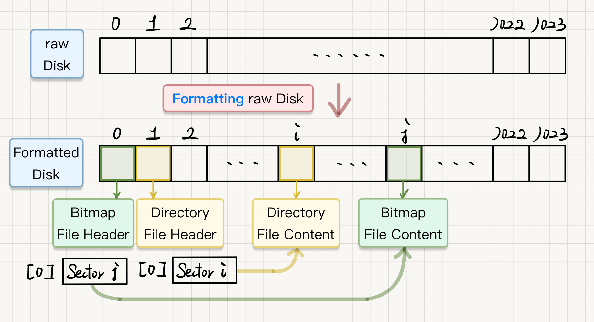
		-	Directory
			-	NachOS 預設 1-Level Directory，實作為一個 Directory Table (Filename <-> FCB Sector #)
				-	Entry 數目 = Directory->tableSize
				-	Directory Table 大小 = ( sizeof(Entry) * tableSize )

			-	Directory 以 File 的形式存在 NachOS 的 File System
				-	Directory 的 FCB(File Header) 指定 存在 Sector 1 = DirectorySector (定義在 filesys.cc)
					(不需要 File Header 的 Location Table 即可順利開啟)
				-	Directory File 會在「OS運作時 保持開啟」以便「操作(R/W、Create、Delete)」

		-	Bitmap
			-	透過 bitmap 來紀錄/分配 Disk Sectors (見 bitmap.h/.cc)
				-	Bits 數目 = Sector 數目 (預設 1024個 Sector) 
				-	Bitmap 大小 = (NumSectors / 8) = 1024 bits/8 = 128 Bytes 剛好為 1 SectorSize

			-	Free Bitmap 以 File 的形式存在 NachOS 的 File System
				-	Bitmap 的 FCB(File Header) 指定 存在 Sector 0 = FreeMapSector (定義在 filesys.cc)
				-	Bitmap File 會在「OS運作時 保持開啟」以便「操作(R/W、Create、Delete)」

-	一些參數的定義 in filesys.cc
	-	FreeMapSector = 0   	// bitmap File 存放的 Sector
	-	DirectorySector = 1   	// Directory File 存放的 Sector
	-	FreeMapFileSize  = (NumSectors / BitsInByte)
	-	NumDirEntries = 10 (此處預設限制了 Directory 的大小，最多存放 10個 File)
	-	DirectoryFileSize = (sizeof(DirectoryEntry) * NumDirEntries)
		-	sizeof(DirectoryEntry) = 15 Bytes * 10 = 150 B

-	預設的限制
	-	不允許「同時存取 同一個 File」
	-	File Size < 3840 Bytes，且大小固定、在創建檔案時隨即決定
		(因為預設 FCB = File Header 的 Table Entry(Data block #, Sector #) 數量有限 = 30個)
	-	1-Level Directory Structure 且 File 數量有限制
		(因為預設 Directory Table 的 Entry(Filename, Sector #) 數量，在 Directory(int size) 被決定)

	-	可靠性低：當 NachOS 中途關閉，會使 FS 壞掉
	-	會產生 Bootstrap 問題，待解決

-	class FileSystem
	
	-	public
		-	建構子：FileSystem(bool format);
			-	背景：在 class synchDisk 被初始化後(可以用 Disk 後)，才會建立 File System
				(因為 class synchDisk 建構子 才會 new Disk(..))

			-	主要功能：格式化 raw Disk 並 Open Dir & Bitmap File
				-	若 format = TRUE，表示 Disk 需要「格式化」-> 建立 new Directory & Free Bitmap
					-	new PersistentBitmap、Directory、FileHeader (Bitmap、Directory) 為了使用 Bitmap & Directory 的方法
						-	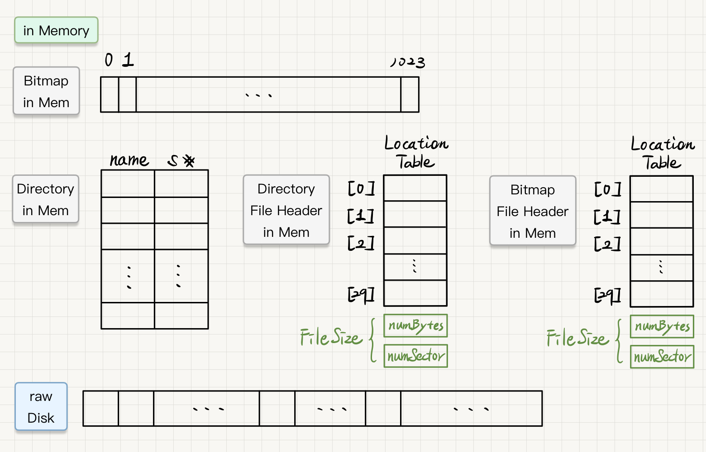

					-	先分配、建立 File Header(FCB) for Bitmap & Dir
					1.	[修改 Bitmap：配 1 Sector 給 File Header]
						在 new Bitmap (in Mem) 上，標記 Sector 0、1 為「使用中」，因為要分配給 Bitmap File Header & Dir File Header 使用
					2.	[修改 File Header：分配 n Sectors 給 File Data Blocks]
						分配 Free Sector 給 Bitmap & Directory 的 File Content (預設 1 Sector) 並修改 Bitmap 的值
					3.	[Write Back File Header]
						將 Bitmap File Header & Dir File Header 寫回 Disk

					-	有了 File Header(FCB) 才能「開啟、修改 File Content」for Bitmap & Dir
					4.	[Open File] 
						開啟 Bitmap & Directory -> 從 Disk 載入「指定 Sector #」的 File Header
					5.	[Write Back Bitmap File Content & Directory File Content]
						將 Bitmap (in Mem) & Directory (in Mem) 寫回 Disk
						-	其中 Bitmap 已經有修改過(已分配了 4 Sectors 給 Bitmap FCB、Bitmap File、Dir FCB、Dir File)
						-	其中 Directory File 則為空(尚未建立任何 File + name + FCB location 在裡面)
					
					-	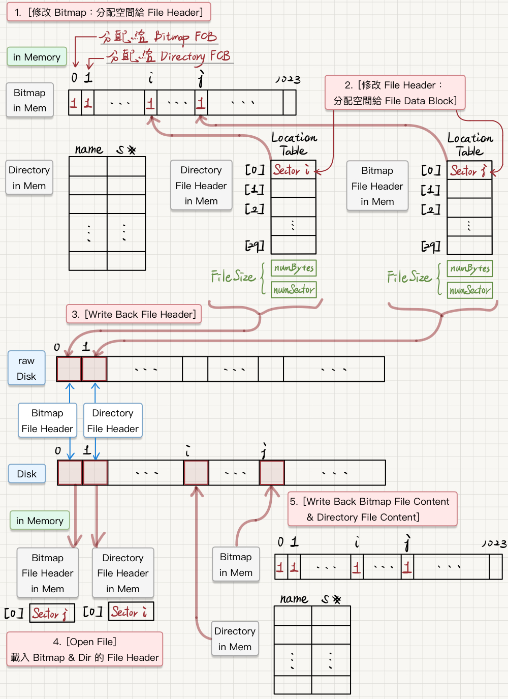
					
				-	若 format = FALSE，表示 Disk 不需要「格式化」-> 開啟 Old Directory & Free Bitmap
					-	[Open File] 
						開啟 Bitmap & Directory -> 從 Disk 載入「指定 Sector #」的 File Header


		-	bool Create(char *name, int initialSize);
			-	背景：NachOS 預設 FS 不支援「Runtime 改變 File Size」，故須在此「固定檔案大小」
			-	主要功能：Create new File = 修改 Dir & Bitmap 並建立 File Header 
				-	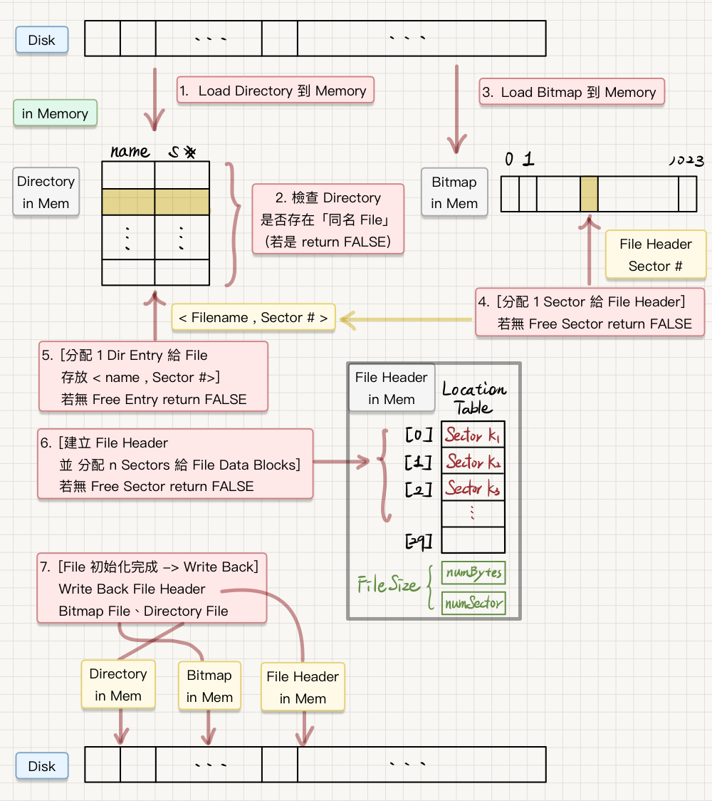
				1.	Load Directory 到 Memory
				2.	檢查 Directory 是否存在「同名 File」
					-	若是 return FALSE

				3.	Load Bitmap 到 Memory
				4.	[分配 1 Sector 給 File Header]
					-	檢查 Bitmap 是否有足夠的 Free Sectors for File Header
					-	若無 return FALSE

				5.	[分配 1 Dir Entry 給 File 存放 < name , Sector #>]
					-	檢查 Directory Table 是否有 Free Entry
					-	若無 return FALSE

				6.	[建立 File Header 並 分配 n Sectors 給 File Data Blocks]
					-	檢查 Bitmap 是否有足夠的 Free Sectors for File Data Blocks
					-	若無 return FALSE

				7.	[File 初始化完成 -> Write Back]
					-	Write Back File Header、Bitmap File、Directory File

		-	OpenFile* Open(char *name);
			-	主要功能：Open a File = Load File Header 到 Memory
						並 return openFile物件(File Header + SeekPosition)
				1.	Load Directory 到 Memory
				2.	找 File Header Sector # -> Load File Header 到 Memory 

		-	bool Remove(char *name);
			-	主要功能：Remove a File = 收回已分配 Sectors & Dir Entry
				1.	Load Directory、File Header、Bitmap 到 Memory 
				2.	收回已分配的 n Sectors for File Data Blocks
					收回已分配的 1 Sectors for File Header
					收回已分配的 1 Entry for <Filename, Sector #>
				3.	[Write Back] Bitmap File、Directory File

		-	void List();
			-	主要功能：List Directory 中的 所有 Filename = 呼叫 directory->List()

		-	void Print();
			-	主要功能：印出 File System 中的所有內容
				1.	印出 Bitmap File Header (Location Table \ FileSize)
					+ Bitmap File Content
				2.	印出 Directory File Header 的所有內容(Location Table \ FileSize)
					+ & Directory File Content
				3.	印出 Bitmap File Content (以 0101... 的格式)

				4.	印出 Directory 中的 所有 Filename & File Content

  	-	private
		-	OpenFile* freeMapFile;		
			-	操作 File System 必須取得 Bitmap 才能分配 Free Sector
		-	OpenFile* directoryFile;
			-	操作 File System 必須取得 Directory 才能管理 File (name <-> FCB)

## [D] HW Basic Q & A

1.	Explain how does the NachOS FS manage and find free block space?
	Where is this information stored on the raw disk (which sector)?
	-	如何找到 Free Block Space?
		Ans：利用 Bitmap->FindAndSet() 來找出 Free Sector 並分配給 File Header & File Data Blocks

	-	NachOS 如何管理 FS?
		Ans：
		-	利用 Bitmap File (in Disk) & PersistentBitmap 物件 (in Mem) 來管理 Sectors
			(操作包含 FetchFrom()、WriteBack()、Mark()、Clear()、Test、FindAndSet()、NumClear()、Print())
		-	利用 Directory File (in Disk) & Directory 物件 來管理 Files
			(操作包含 FetchFrom()、WriteBack()、Find()、Add()、Remove()、List()、Print())

	-	FS 的資訊存在 Raw Disk 的哪個 Sector?
		Ans：Bitmap File Header(FCB) 存在 Sector 0；Directory File Header(FCB) 存在 Sector 1

2.	What is the maximum disk size can be handled by the current implementation? Explain why.
	-	未修改前的 NachOS File System，可以使用的「最大 Disk Size」？
		Ans：
		-	Bitmap File Header 佔 1 Sector、Bitmap File Content 佔 1 Sector 共 2*128 B
		-	Directory File Header 佔 1 Sector 共 128 B
			Directory File Content = Directory Table Size (預設 10個 Entry) 共有 10*15 B (2 Sectors)
			( 每個 Entry < name(10 B), SectorNum(4 B), inUse(1 B)> 共 15 B )

		-	每個 File Header 的 Location Table 包含 30個 Entry，故 Max File Size = 30*128B = 3840 B
		-	Directory Table 預設有 10個 Entry，可指向 10個 File
   			-	每個 File Header 佔 1 Sector，10 Files 佔 10*128 B
			-	每個 File Content 最多站 30 Sectors，10 Files 佔 10*3840 B
		
		-	加總以上，有 128*(5+10+ (30*10)) = 40320 Bytes
			比較 模擬 Disk 大小 = (1024 SectorSize) = 128 KB = 131072 Bytes
			

3.	Explain how does the NachOS FS manage the directory data structure?
	Where is this information stored on the raw disk (which sector)?
	-	NachOS 如何管理「Directory Structure」?
		Ans：同 1.

4.	Explain what information is stored in an inode, and use a figure to illustrate the disk allocation scheme of current implementation.
	-	inode 存什麼資訊？
		Ans：
		-	inode (in Linux) 就是 File Control Block(FCB)
			儲存 inode #、Permission、Date、Owner、File Size、Ref. Count、Data Block Location ... etc
			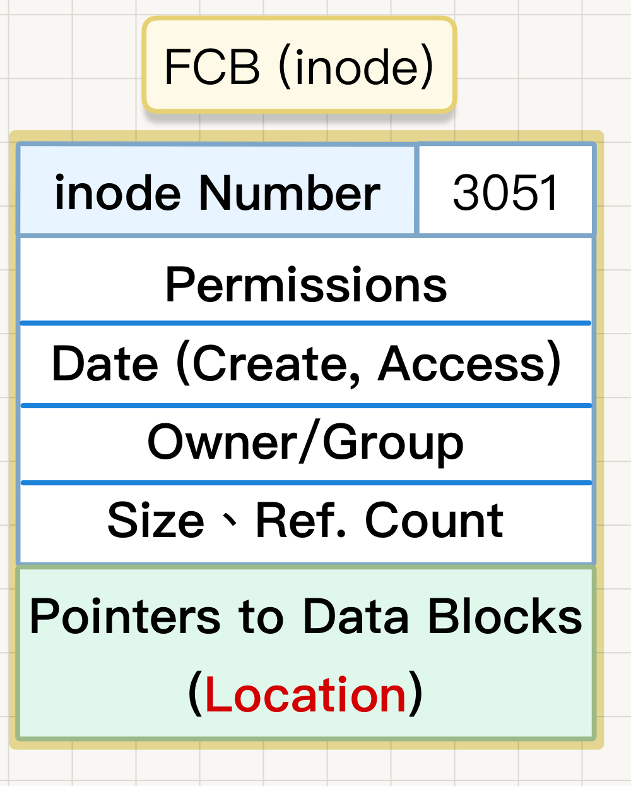

		-	在 NachOS FS 中 就是 File Header

	-	未修改前 NachOS，採用的 Disk Allocation Method ?
		Ans：
		-	Disk Allocation Method = Free Sectors 分配給 File 的方式，一般三種
			1.	Contiguous Allocation (Extent-Based FS)
			2.	Linked Allocation (FAT)
			3.	Index Allocation (Linked List、Multi-level、Combined)
		-	NachOS FS 將 File 所有 Data Blocks 存放的 Sector # 集中於 File Header 的 Location Table 管理 -> 屬於 1-Lv Index Allocation

5.	Why a file is limited to 4KB in the current implementation?
	-	未修改前 NachOS，為何限制 File Size ≤ 4KB
		Ans：
		-	因為 File Header 的 Location Table 為了能塞進 1 Sector，限制了 Entry 數 = 30 個
			導致 單一 File 最大只會佔用 30 Sectors = 30*128B = 3840 Bytes ≤ 4KB

## [F] 重點：NachOS 檔案操作流程 
	-	建立檔案的步驟 in NachOS FS
		1.	從 Disk 讀出 freeMap & directory
			1.	載入 freeMap 到 Memory
				-	freeMap = new PersistentBitmap(freeMapFile,NumSectors);
				-	不需要 告知 freeMap 在 Disk 的 Sector #，因為固定存在 Sector 0

			2.	載入 Directory 到 Memory
				1.	要先知道「目錄檔案的 Sector #」，才能 開啟目錄
					-	dirFile = new OpenFile(dirSector); <- 從 Disk 讀出 目錄 File Header
				2.	「已開啟」的目錄，才能 Load 到 Memory 查詢
					-	directory = new Directory(NumDirEntries);
					-	directory->FetchFrom(directoryFile); <- 其中 directoryFile 是已開啟的檔案 ( OpenFile* )
						(根據 File Header 將 目錄 Load 到 Memory)

		3.	建立 File Header 才能分配 Sector 給 File Header & File Content

			-	hdr = new FileHeader;
			-	分配 Sector 給 File Header，並得到 File Header 的 Sector #
				sector = hdr->AllocateHDR(freeMap, FileSize, FALSE);
			-	分配 Sector 給 File Header & File Content
				hdr->Allocate(freeMap, FileSize);

		4.	將 File 加入 目錄 <name, sector #>
			-	directory->Add(name, sector)

		6.	將 File Header、Directory、freeMap 寫回 Disk
			-	hdr->WriteBack(sector); 		
            	directory->WriteBack(parentDirFile);
            	freeMap->WriteBack(freeMapFile);

			-	收回分配的記憶體空間
				delete hdr;
				delete directory;
        		delete freeMap;

	-	開啟檔案的步驟 in NachOS FS
		1.	先找到檔案的 Sector (開啟目錄，根據 Filename 找到 sector #)
			-	載入 Directory 到 Memory
				1.	要先知道「目錄檔案的 Sector #」，才能 開啟目錄
					-	dirFile = new OpenFile(dirSector); <- 從 Disk 讀出 目錄 File Header
				2.	「已開啟」的目錄，才能 Load 到 Memory 查詢
					-	directory = new Directory(NumDirEntries);
					-	directory->FetchFrom(directoryFile); <- 其中 directoryFile 是已開啟的檔案 ( OpenFile* )
						(根據 File Header 將 目錄 Load 到 Memory)
					
			-	查詢 目錄 -> 找到 Filename 對應的 Sector #
				-	sector = directory->Find(name);

		2.	根據 Sector # 讀出 File Header 並存到 OpenFile 物件
			-	file = new OpenFile(sector);
			-	之後才能對 File 進行 R/W

	-	關閉檔案的步驟 in NachOS FS
		-	delete (OpenFile*) file;

	-	刪除檔案的步驟 in NachOS FS
		1.	先找到檔案的 Sector (開啟目錄，根據 Filename 找到 sector #)
			-	載入 Directory 到 Memory
				1.	要先知道「目錄檔案的 Sector #」，才能 開啟目錄
					-	dirFile = new OpenFile(dirSector); <- 從 Disk 讀出 目錄 File Header
				2.	「已開啟」的目錄，才能 Load 到 Memory 查詢
					-	directory = new Directory(NumDirEntries);
					-	directory->FetchFrom(directoryFile); <- 其中 directoryFile 是已開啟的檔案 ( OpenFile* )
						(根據 File Header 將 目錄 Load 到 Memory)
					
			-	查詢 目錄 -> 找到 Filename 對應的 Sector # (File Header Sector #)
				-	sector = directory->Find(name);

		2.	收回分配的 Sector
			-	fileHdr = new FileHeader;
				fileHdr->FetchFrom(sector);
				fileHdr->Deallocate(freeMap); 
				fileHdr->DeallocateHDR(freeMap,dirSector);

		3.	從 Directory 中移除
			-	directory->Remove(filename);

# Part 2 Implement page table in NachOS
---------------------------------------------------------------------

## [A] 作業內容

### [A.1] 基本作業內容
1.	Support file I/O system call and larger file size
	(1)	Combine your MP1 file system call interface with NachOS FS  

		-	int Create(char *name, int size);
			Create a file with the name and with size bytes in the root directory.
			檔名僅包含 [A-Za-z0-9.] 且長度 ≤ 9，若開啟成功 return 1

		-	OpenFileId Open(char *name);
			Open the file with name and return its OpenFileId (最多一次開一個 File)
			只要 OpenFileId > 0 就是成功開啟

		-	int Read(char *buf, int size, OpenFileId id);
			int Write(char *buf, int size, OpenFileId id);
			Read/Write size characters from/to the file to/from buf.
			Return 成功 R/W 的 Character 數目

		-	int Close(OpenFileId id);
			Close the file by id. Here, 若關閉成功 return 1

	(2)	Support up to 32KB file size  

		-	提示
			-	可修改 Allocation scheme 或 擴增 Data Block Pointers Structure
			-	不可修改 Sector Size
			-	假設不會有人為錯誤操作
				(若 Copy a File larger than 32KB，印出警告「non-existing file」)
		-	利用以下指令 來確認正確性
			-	Format the disk on NachOS.
				>nachos -f
			-	Copy a file from Linux FS to NachOS FS.
				>nachos -cp <file_to_be_copied> <destination_on_NachOS_FS> 
			-	Print the content of a file on NachOS disk.
				>nachos -p <file_to_be_dumped>

2.	Support subdirectory
	-	假設不會有人為錯誤操作
		(try to remove a non-existing file, try to copy file into a non-existing directory, create a directory in a non-existing directory)

   	(1)	Implement the subdirectory structure

		-	採用 ‘/’ 作為 path name separator
		-	Path Name 最長 ≤ 255.
		-	Directory & File Name 最長 ≤ 9
		-	所有路徑皆為「絕對路徑」
		-	Support 遞迴法 List File/Directory in a Folder(Directory)

	(2)	Support up to 64 files/subdirectories per directory
		(每個資料夾下 支援最多 64個 檔案/資料夾)

		-	利用以下指令 來確認正確性
			-	Format the disk on NachOS.
				>nachos -f

			-	Copy a file from Linux FS to NachOS FS.
				>nachos -cp <file_to_be_copied> <destination_on_NachOS_FS> 

			-	Print the content of a file on NachOS disk.
				>nachos -p <file_to_be_dumped>

			-	Create a directory on NachOS disk.
				>nachos -mkdir <directory_to_be_created>

			-	Delete a file (not a directory) from NachOS FS.
				>nachos -r <file_to_be_deleted> 

			-	List the file/directory in a directory.
				>nachos -l <list_directory>

			-	Recursively list the file/directory in a directory. The Directory will always exist.
				>nachos -lr <directory_to_be_listed> 

### [A.2] Bouns 作業內容

3.	Support even larger file size
	(1) Extend the disk from 128KB to 64MB
	(2) Support up to 64MB single file

4.	Multi-level header size
	(1) Show that smaller file can have smaller header size.
	(2) Implement at least 3 different size of headers for different size of files

5.	Recursive Operations on Directories
	(1) Support recursive remove of a directory
	-	Remove the file or recursively remove the directory.
		>nachos -rr <file/directory_to_be_removed>

## [B]	實作內容

### [B.1] Support file I/O system call and larger file size

1.	Combine your MP1 file system call interface with NachOS FS  
	-	重大前提：要先將 Program File(執行檔) Copy 到 NachOS File System 才可被執行
		-	當不採用 File_stub 後，將 User Program Load 到 Memory 的動作
			是從「NachOS 模擬 Disk」載入 NachOS 模擬 Memory 
			若 NachOS 模擬 Disk 沒有該 Program File = 找不到 File Header -> Open File Failed

		-	錯誤的發生地：AddrSpace::Load(char *fileName)
			-	此處會呼叫 kernel->fileSystem->Open(fileName) 會試圖開啟 Program File
				但因 NachOS 模擬 Disk 沒有該檔案，而開啟失敗

		-	解決方法：要先將 Program File 從 Host FS Copy 到 NachOS FS 中
			-	採用'-cp'指令：../build.linux/nachos -cp FS_test1 FS_test1

	-	測試作業的步驟
		1.	將 Disk 格式化，並 Copy 程式執行檔(FS_test1) 到 NachOS FS 中
		2.	執行 FS_test1：建立 new NachOS File 並 寫入指定字串 後 關閉檔案
		3.	Copy 程式執行檔(FS_test1) 到 NachOS FS 中
		4.	執行 FS_test2：開啟 NachOS File 並 讀出指定字串 後 關閉檔案
		以上皆正確，即完成「NachOS FS 的 System Call 對接」

	-	修改的檔案
		-	exception.cc 的 ExceptionHandler(..) 會呼叫 System Call 的函式
			-	SC_Create 中會呼叫 SysCreate(..) 需要多傳遞 FileSize 這個參數
			-	原本為：status = SysCreate(filename);
			-	修改後：
				status = SysCreate(filename, (int)kernel->machine->ReadRegister(5));

		-	syscall.h 中定義了 SysCall 介面

		-	ksyscall.h 中的 SysCreate() 實作
		-	filesys.h/.cc 中的 class FileSystem 實作
			-	利用 Open-File Table 紀錄 User Program 開啟的 File 
				-	新增私有成員，提供 OpenFileTable & 操作方法
				-	OpenFile* openFileTable[NumOFTEntries];
					int openFileCount;		// Process 開啟的 File 數
					int FindFreeEntry();	// 從頭開始找「第一個 Free Entry」後回傳 Index

			-	對接 System Call Interface in ksyscall.h
				-	OpenFileId OpenReturnId(char *name);
					-	呼叫 Open()
					-	若成功開啟，紀錄在 openFileTable 並 openFileCount++
					-	return Index

				-	int Close(OpenFileId fileId);
					-	將 File 從 openFileTable 移除 並 openFileCount--
					-	只有透過 OpenReturnId(..) 開啟的 NachOS File 才需要 Close()
					-	原生的 Open(..) 是給 Kernel 內部使用 ex. 開啟 Program File
						不會紀錄在 Open-File Table，因為開起來就直接 Load 到 Memory
				-	int Write(OpenFileId fd,char *buffer, int nBytes);
					int Read(OpenFileId fd,char *buffer, int nBytes);

2.	Support up to 64MB(32KB) file size
	-	(Bonus 3、4) 必須有更大的、動態的 File Header = 實作 Multi-Level Index Allocation
		-	會產生 Multi-level header size
			-	不同 File Size 有不同 大小的 File Header
			-	目前設計 4種大小的 File Header	
				1.	Direct (9 Entries)：9 * 128 = 1152 B
				2.	Single indirect (32 Entries)：32*128 = 4096 B = 4 KB
				3.	Double indirect (32*32 Entries)：32*32*128 = 131072 B = 128 KB
				4.	Triple indirect [16] 共 16組
					(16*32*32*32 Entries)：16*32*32*32*128 = 67108864 B = 64 MB
			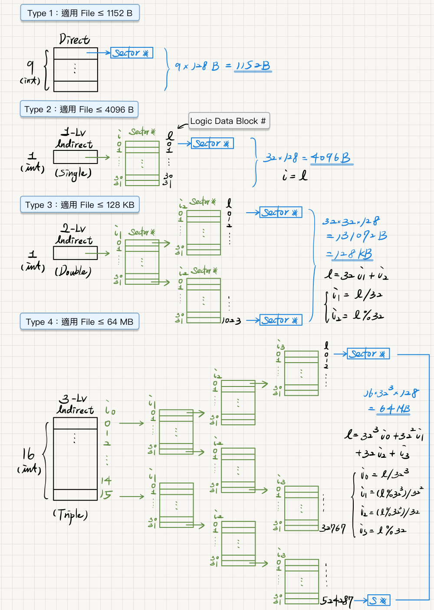  

	-	資料結構(變數成員) in class FileHeader
		-	File Size：int numBytes; int numSectors;	
		-	Direct Access Sector：int direct[9];
		-	Indirect Access Sector：
			-	int singleLv;
				int *sTable;
			-	int doubleLv;
				int **dTable;
			-	int tripleLv[16];
				int ****tTable;
		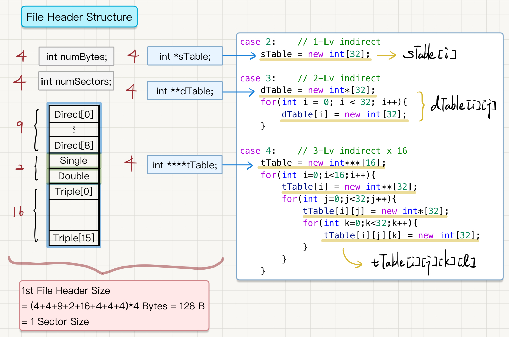  

	-	修改的檔案
		-	Disk.h 中 將 NumTracks 改為 16384，使 Disk 擴增到 64 MB
			(16384 * 32 * 128 B = 64MB)
			-	Sector 數量暴增 = 524288 個，表示 Bitmap 要擴大
				( Bitmap 需要 524288 bits = 65536 Bytes = 512 個 Sectors 才能存完)
			-	注意！要先 test 資料夾內的「舊的 DISK_0 (130 KB)」刪去，NachOS 才會建立一個「新的 DISK_0 (64 MB)」
				不然會因為無法讀取到後面的 Sector 而 Error

		-	filesys.cc
			-	Create() 要幫 File 配置不同 Size 的 File Header
				-	注意！要先 hdr = new FileHeader; & sector = hdr->AllocateHDR(freeMap,initialSize,TRUE);
					才能 hdr->Allocate(freeMap, initialSize)
			-	Remove() 要收回 不同 Size 的 File Header
				-	注意！要先 fileHdr->Deallocate(freeMap); 才能 fileHdr->DeallocateHDR(freeMap,sector);

		-	filehdr.h/.cc
			-	小工具
				-	int WhichLevel(int sectors)：依照 File Data 所佔 Sectors 數目，決定採用哪種 File Header 結構
				-	從 sector 存取 Index Table (已保證該 Sector 僅存放符合格式的 Index Table)
					-	void ReadTable(int sector, int* table);
					-	void WriteTable(int sector, int* table);
				-	從 Memory (sTable、dTable、tTable 指向空間) 存取 Index Table
					(必須確保 Index Table 已在 AllocateHDR()、FetchFrom() 中 載入 Memory，才能使用此方法)
					(透過此方法修改玩 Data Sector，務必 WriteBack() 才會真正將資料寫入 Disk)
					-	int GetIndexTable(int logic); 
						return File 的「第 logic 個 Data Sector」所存的資料
					-	void LoadIndexTable(int logic, int data);
						將 data 存入 File 的「第 logic 個 Data Sector」

			-	動態配置 Index Table in Memory
				-	方法
					-	void AllocateTableInMem(int lv);
						-	動態配置空間給 sTable、dTable、tTable，並將 Indirect Index Table 載入到該空間 (in Memory)
					-	void DeAllocateTableInMem(int lv);
				-	時機
					-	AllocateHDR()、FetchFrom() -> 動態配置 Index Table in Memory
					-	DeAllocateHDR()、WriteBack() -> 收回 動態配置的 Index Table in Memory

			-	Allocate File Header 佔用的空間
				
				-	int AllocateHDR(PersistentBitmap *freeMap, int fileSize, bool firstSector);
					-	依照不同 File Size -> 使用到不同 Level 的 indirect Table
						-	為 File Header、Index Table 配置 Free Sector (修改 Bitmap in Memory)
							此處會先將 分配好儲存 Index Table 的 Sector 寫入 Disk 中，等到 Bitmap WriteBack Disk 即真正完成配置
						-	為 Index Table 動態配置「記憶體空間」，並由 sTable、dTable、tTable 來指

				-	void DeallocateHDR(PersistentBitmap *freeMap, int sector);
			
			-	ByteToSector() 在 OpenFile->ReadAt()/WriteAt 會用到，需要修改從 Index Table 取得 Sector #

			-	從 Disk 中 載入 FIle Header + Index Table & 將 FIle Header + Index Table 寫回 Disk
				-	FetchFrom()
					-	將 File Header & Index Table 從 Disk 中 存入 Memory = 存入 sTable、dTable、tTable 指向的「動態分配空間」
				-	WriteBack()
					-	將 File Header & Index Table 從 Memory 中 寫回 Disk 
						= 將 sTable、dTable、tTable 指向空間 的資料(Data Block Sector #) 寫回 Disk

			-	為 File Content 配置/收回 Sector
				-	bool Allocate(PersistentBitmap *bitMap, int fileSize);
					-	可直接將配置的 Sector # 先存入 Memory 中(sTable、dTable、tTable 指向空間)，未來再 WriteBack() 回 Disk
					-	LoadIndexTable(i,freeMap->FindAndSet());
				-	void Deallocate(PersistentBitmap *bitMap);
					-	根據 Index Table in Memory (sTable、dTable、tTable 指向空間)，來收回「已分配的 Sector #」
					-	freeMap->Clear((int) GetIndexTable(i));

			-	Print() 改為根據 Index Table in Memory 來找到 Data Block Sector #，並從 Disk 讀出後再印在螢幕上

	-	測試作業的步驟
		-	Format the disk on NachOS.
			>nachos -f
		-	Copy a file from Linux FS to NachOS FS.
			>nachos -cp <file_to_be_copied> <destination_on_NachOS_FS> 
		-	Print the content of a file on NachOS disk.
			>nachos -p <file_to_be_dumped>

### [B.2] Implement the subdirectory structure
1.	規格
	-	不會有人為錯誤操作
		(ex. try to remove a non-existing file, try to copy file into a non-existing directory, create a directory in a non-existing directory)
	-	採用 ‘/’ 作為 Path name separator
	-	Path Name 最長 ≤ 255.
	-	Directory & File Name 最長 ≤ 9
		-	directory.h 中的 #define FileNameMaxLen		9
	-	所有路徑皆為「Absolute Path」
	-	Support 遞迴法 **List** File/Directory in a Folder(Directory)
	-	(Bonus 5) Support 遞迴法 **Remove** File/Directory in a Folder(Directory)
	-	Support up to 64 files/subdirectories per directory
		-	修改 filesys.cc 中的 #define NumDirEntries 	64

2.	重要目標：完成以下操作
	-	在「任意路徑」建立 Subdirectory 
		>nachos -mkdir <directory_to_be_created>

	-	在「任意路徑」刪除 File/Subdirectory
		>nachos -r <file_to_be_deleted> 

	-	在「任意路徑」列出(List) File/Subdirectory
		>nachos -l <list_directory>

	-	在「任意路徑」列出(List) File/Subdirectory 以及 其內 所包含的所有 File/Subdirectory
		(Recursively list the file/directory in a directory.)
		>nachos -lr <directory_to_be_listed>

	-	在「任意路徑」刪除(Remove) File/Subdirectory 以及 其內 所包含的所有 File/Subdirectory
		>nachos -rr <file/directory_to_be_removed>

	-	其他測試指令
		-	[v] Format the disk on NachOS.
			>nachos -f

		-	[v] Copy a file from Linux FS to NachOS FS.
			>nachos -cp <file_to_be_copied> <destination_on_NachOS_FS> ™

		-	[v] Print the content of a file on NachOS disk.
			>nachos -p <file_to_be_dumped>

	-	注意
		-	實作 SubDirectory 以後，輸入的 name 都是 Absolute Path，皆須透過一個方法 取出實際 Filename & Parent Directory
		-	指令中涉及的 File，都需要提供完整的 Absolute Path
			ex. ../build.linux/nachos -mkdir /dir/a -e /dir/halt 
				= 在 目錄dir 下新增目錄a，並執行 在 目錄dir 下的 User Program File(halt)

3.	修改的檔案
	-	修改參數
		-	修改 Directory 可容納的 File 個數
			在 filesys.cc 中的 #define NumDirEntries 	64
		
		-	定義 path 的最大長度，若超過 PathParse(..) 會 return -1
			在 filesys.h 中的 #define pathNameMaxLen 256

	-	main.cc 新增/更動 Command Line 指令，包含
		-	'-l' List Nachos Directory 下的 子目錄 & 檔案 
			-	需加入 dirPath 以儲存 路徑
			-	kernel->fileSystem->List(dirPath,FALSE);

		-	'-mkdir' 建立一個 新資料夾(new Dir)
			-	kernel->fileSystem->Create(subDirPath,0,1);

		-	'-lr' 印出 dirPath 下的 子目錄/File 及其下的所有 子目錄/File
			-	kernel->fileSystem->List(dirPath,TRUE);

		-	'-rr' 刪除 某個 dirPath 下的 子目錄/File 及其下的所有 子目錄/File
			-	kernel->fileSystem->RecursiveRemove(dirPath);

	-	filesys.h/.cc (主要1)
		-	需熟悉「建立檔案的步驟、開啟檔案的步驟、刪除檔案的步驟」
		-	int PathParse(char *path, char *filename);
			-	主要功能
				-	分析 Path 回傳 ParentDirectory 的 Sector # 以及 Path 代表的 Filename
				-	Path = /a/b/c，則回傳 b sector # 以及 Filename = c
				-	Path = /a，則回傳 root sector # 以及 Filename = a
				-	Path = /，則回傳 root sector # 以及 Filename 會另外設為 root

		-	bool Create(char *name, int initialSize, int type); 
			-	主要功能：根據 type (0 File, 1 Dir) 來在 absolutePath 建立 File/Dir

		-	OpenFile* Open(char *absolutePath);
			-	主要功能：根據 absolutePath 打開 File (載入 File Header 並回傳)
		
		-	void List(char *path, bool recursice);
			-	主要功能：
				根據 recursice 來 List Path 的 File/Dir
				0: 僅列出當前目錄下的檔案
				1: 列出當前目錄下，以及其內的所有 檔案/目錄

		-	bool Remove(char *absolutePath);
			-	主要功能：刪除 absolutePath 所代表的 File/Dir

		-	void RecursiveRemove(char *path);
			-	主要功能：刪除 path 所在目錄下 的所有 Files/Directories

	-	directory.h/.cc (主要2)
		-	判斷該 File 屬於 File(0) 或 Directory(1)
			-	class DirectoryEntry 加入 int isDir; 
				-	若是 Directory，則在 RecursiveList() & RecursiveRemove() 則需要往下遞迴
			-	int IsDirectory(char *name);
				-	提供外部 判斷 File 的方法
			-	Directory(int size); 加入了初始化 isDir 的程式碼
				-	table[i].isDir = IsFile;
			-	bool Add(char *name,int newSector, int isfile);
				-	根據 isfile 紀錄 new Entry 是 File 或 Directory

		-	void PrintNBlanks(int n){ printf("%*c",n,' '); }
			-	印出 n 的 ' ' 字元，是 printf() 的有趣應用

		-	void RecursiveList(int cnt);
			-	主要功能：
				將「某個目錄」以下的 table[i].name 印出
				若 table[i].isDir = 1 則 再次呼叫 RecursiveList(cnt+3) 將其下元素印出
				其中 cnt 表示 遞迴深度：遞迴越深，一開始要印出的空格越多 
			-	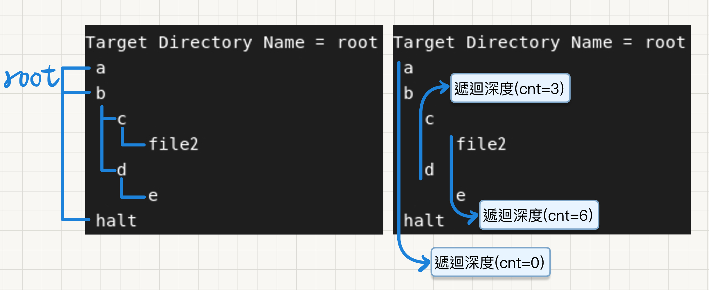

		-	void RecursiveRemove(PersistentBitmap* freeMap);
			-	主要功能：
				在該層級的 Directory 下，刪除 所有的 File (Desllocate & Remove Entry)
				注意：因刪除時 需要「收回空間」故必須傳遞「freeMap」，並在將來 WriteBack

	-	因 class FileSystem 中方法的修改，需要隨之更改的地方 
		-	main.cc 中的 Copy() 需要為 fileSystem->Create(..) 新增引數(決定是新增 File 還是 Dir)
		-	ksyscall.h 中的 SysCreate() 需要為 fileSystem->Create(..) 新增引數(決定是新增 File 還是 Dir)
	

# Additional Note for vscode
-	How to open multiple Windows for the same Working directory?
	1.	Ctrl/Cmd + Shift + P to bring up the command palette
	2.	Search for "Workspaces: Duplicate Workspace In New Window"