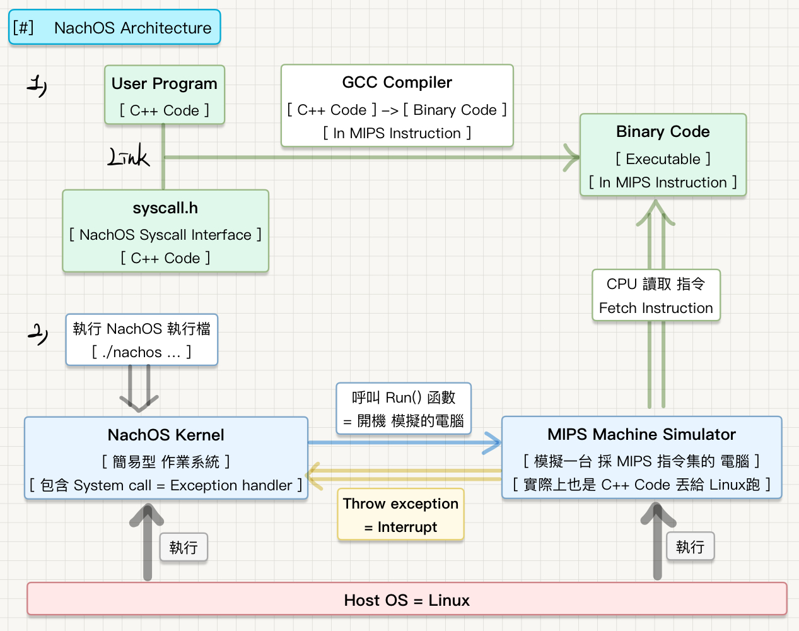

# OS Assignment: NachOS Implementation

## Assignment
- MP1：System call implementation 
- MP2：[Mem] Paging implementation
- MP3：[CPU] Multilevel feedback queue scheduler
  - L1: preemptive SFJ
  - L2: non-preemptive Priority 
  - L3: Round-Robin
- MP4：[FS] File system implementation
  - Support file I/O system call
  - Support up to 64MB file size (from 3840 Bytes)
  - Subdirectory implementation

## NachOS Folder info

- [Folder]	Stub: NachOS Code for MP1~MP3  
- [Folder]  FS: NachOS Code for MP4
- [Folder]	Assignment: Criteria & Notes

----

## Environment

- Virtual OS: Red Hat Enterprise Linux 9 (RHEL 9 x86_64)
- Virtual Machine: Parallels Desktop 18.1.1

## Build NachOS

- Go to https://github.com/Jonaskeep666/NachOS-Installation-Guide-and-Experience

